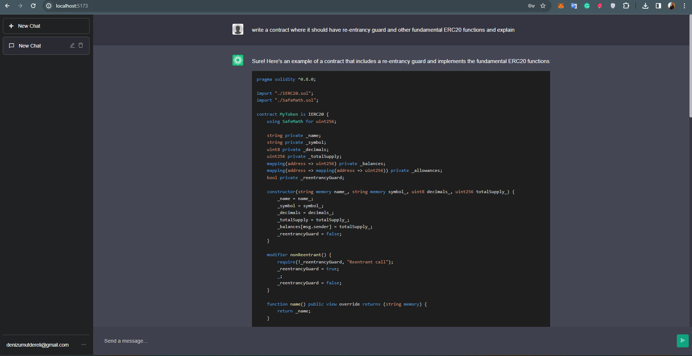
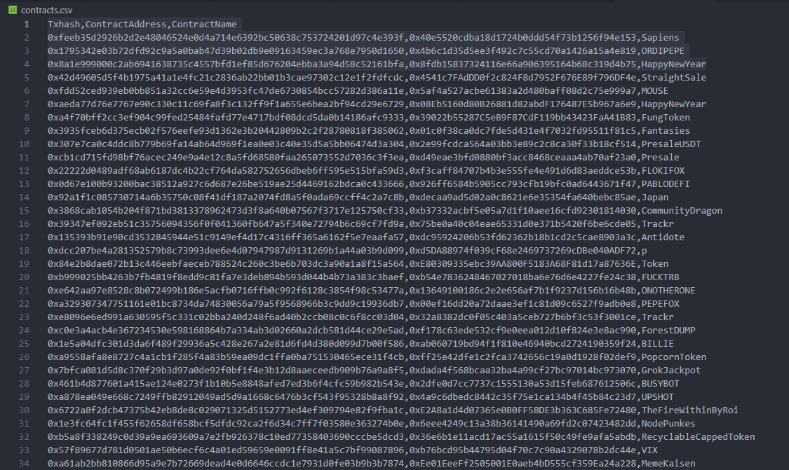

# Solidity Smart-Contract Advisor

## Table of Contents
- [Solidity Smart-Contract Advisor](#solidity-smart-contract-advisor)
  - [Table of Contents](#table-of-contents)
  - [Introduction](#introduction)
  - [Technology Stack](#technology-stack)
  - [Core Components](#core-components)
    - [Smart Contract Retrieval](#smart-contract-retrieval)
    - [Documentation Processing](#documentation-processing)
    - [LangChain and Embedding Tokenizer](#langchain-and-embedding-tokenizer)
    - [Parsing and Embedding](#parsing-and-embedding)
    - [Weaviate Vector Database](#weaviate-vector-database)
    - [UI Development](#ui-development)
    - [Flask API](#flask-api)
    - [LangChain](#langchain)
      - [Power of Agents](#power-of-agents)
      - [Augmented Retrievals](#augmented-retrievals)
      - [Integration Benefits](#integration-benefits)
  - [Usage](#usage)
  - [Project Setup and Installation](#project-setup-and-installation)
    - [Prerequisites](#prerequisites)
    - [Step-by-Step Guide](#step-by-step-guide)
  - [Contributions](#contributions)
  - [Future Enhancements](#future-enhancements)
    - [Enhanced Contextual Learning](#enhanced-contextual-learning)
    - [Advanced GUI Features](#advanced-gui-features)
    - [Integration with Development Tools](#integration-with-development-tools)
    - [AI and ML Advancements](#ai-and-ml-advancements)
    - [Community and Ecosystem Integration](#community-and-ecosystem-integration)
    - [Integration with YUL and Opcode Optimization](#integration-with-yul-and-opcode-optimization)
  - [License](#license)
  - [Contact](#contact)

## Introduction
The Solidity Smart-Contract Advisor is a cutting-edge tool designed to extend the capabilities of traditional language models in understanding and advising on Solidity smart contracts. At its core, the project integrates OpenAI's language models with a vast repository of verified smart contracts and comprehensive Solidity documentation, creating a specialized, context-aware system capable of delivering expert insights in the realm of smart contract development.

This project represents a significant stride in bridging the gap between general-purpose language models and the nuanced, specialized requirements of blockchain development. By training on over 5,000 verified smart contracts and extensive Solidity documentation, the advisor provides not just theoretical answers, but practical, real-world advice grounded in verified code and documentation.

Success was measured by the system's ability to accurately parse, understand, and provide context-relevant advice on complex Solidity queries. This was achieved through a sophisticated blend of technologies, each playing a crucial role in enhancing the system's effectiveness.

## Technology Stack
- [MongoDB](https://www.mongodb.com/): For efficient data storage and management.
- [Python](https://www.python.org/): The primary programming language for backend development.
- [Flask API](https://flask.palletsprojects.com/): Creating a scalable server-side application.
- [LangChain](https://github.com/nickcdryan/LangChain): Enhancing the language model with a specialized Embedding Tokenizer and RetrievalQA logic.
- [OpenAI Embeddings](https://beta.openai.com/): Leveraging advanced language understanding capabilities.
- [Weaviate Vector Database](https://www.semi.technology/developers/weaviate/): Managing and querying vectorized data.
- [ReactJS](https://reactjs.org/): For building a dynamic and responsive user interface.
- [TypeScript](https://www.typescriptlang.org/): Enhancing JavaScript with types for more robust frontend code.




## Core Components
### Smart Contract Retrieval
Using etherscan.py, downloaded 5,000 known and verified smart contracts from Etherscan API. This forms the backbone of our analysis, providing real-world smart contract code for embedding and analysis.

### Documentation Processing
Alongside smart contracts, extracted documentation as HTML files from the Solidity documentation website, ensuring a comprehensive base for the language model.

### LangChain and Embedding Tokenizer
Custom-built LangChain RetrievalQA model processes the above data. I've created embedding chunks of size 1000 with an overlap of 1000, resulting in around 200,000 chunks for detailed analysis.

### Parsing and Embedding
For smart contracts, a Solidity-specific parser breaks down the contracts into manageable chunks. 
For the HTML content (the official documentation of the solidity), I employ a standard text splitter. These parsed chunks are then embedded for further processing.

### Weaviate Vector Database
In this project, the Weaviate Vector Database, equipped with the text2vec-contextionary module, plays a pivotal role in managing and querying vectorized data derived from Solidity smart contracts and documentation. Vector databases like Weaviate are designed to handle vectorized data – essentially, data points represented in multi-dimensional space. This is particularly useful in the realm of machine learning and natural language processing, where complex data can be vectorized for efficient and meaningful analysis.

Weaviate utilizes machine learning models to convert text data into these vectors, allowing for high-speed and semantically relevant searches. In the context of the Solidity Smart-Contract Advisor, Weaviate stores and manages the embeddings (vector representations) of Solidity contracts and documentation. These embeddings capture the nuanced meanings and contexts of the text, enabling the system to provide accurate, context-aware responses to user queries.

The text2vec-contextionary module specifically is critical for understanding the textual context. It allows the system to interpret the meaning behind words and phrases in the context of Solidity, enhancing the relevance and accuracy of search results and responses.

The role of Weaviate in this project is multifaceted:
1. **Efficient Data Retrieval**: By converting text into vectors, Weaviate enables fast and efficient retrieval of relevant information.
2. **Semantic Search**: It goes beyond keyword matching, allowing for semantic search capabilities. This means the system can understand and respond to queries not just based on keywords but also the underlying concepts and contexts.
3. **Scalability**: Weaviate is designed for scalability, handling the large volume of data generated from the 5,000 smart contracts and extensive documentation.
4. **Integration with AI Models**: Its compatibility with AI models like OpenAI's embeddings makes it an ideal choice for projects that merge traditional data storage with advanced AI capabilities.
5. **Overcoming Tokenization Limits**: One of the challenges with traditional Language Model (LM) tokenization is the limit on the number of tokens that can be processed in a single request. By creating and managing embeddings, Weaviate provides a workaround to these limitations. It allows for the handling and analysis of large and complex texts (like entire smart contracts) beyond the token limit imposed by LLMs. This feature is crucial in maintaining the integrity and context of longer documents or codes, enabling more thorough and accurate analysis in the Solidity Smart-Contract Advisor.

For more information on Weaviate and its capabilities, you can visit their official website and documentation:
- [Weaviate Official Website](https://www.semi.technology/developers/weaviate/)
- [Weaviate Documentation](https://www.semi.technology/developers/weaviate/current/)

The use of Weaviate in this project ensures that the Solidity Smart-Contract Advisor is not only powerful in its analytical capabilities but also efficient and scalable, making it a state-of-the-art tool for smart contract analysis and advice.


### UI Development
I adapted and significantly modified the UI from [whuang214](https://github.com/whuang214) This ReactJS and TypeScript-based interface resembles a ChatGPT interaction model, tailored for our specific use case.

### Flask API
This Python-based Flask API serves as a crucial bridge between user queries and the powerful backend. It efficiently handles interactions with the Weaviate vectors and leverages OpenAI's GPT-4-0613 model for generating responses. The choice of GPT-4-0613 is strategic, due to its less restrictive nature, which is particularly beneficial for providing more direct and unfiltered answers on sensitive topics, such as re-entrancy in smart contracts.

For those interested in exploring other OpenAI Language Models, a comprehensive list can be found at [OpenAI's Model Overview](https://platform.openai.com/docs/models).

Additionally, the Flask API integrates LangChain, a framework designed to enhance the capabilities of language models through agents and prompt engineering. LangChain's modular architecture allows for easy integration of different language models, making the system highly adaptable and extendable. With the same interface, various other language models could be seamlessly incorporated, offering flexibility and scope for future enhancements in response capabilities.

The combination of Flask, Weaviate, and LangChain provides a robust, scalable, and versatile backend infrastructure, capable of handling complex queries with precision and delivering contextually relevant responses in the domain of Solidity smart contracts.


### LangChain
[LangChain](https://www.langchain.com/) represents a revolutionary approach in the utilization of language models, playing a vital role in our Solidity Smart-Contract Advisor project. It's a framework specifically designed to augment the capabilities of language models, such as those provided by OpenAI, through the use of agents and augmented retrievals.

#### Power of Agents
In LangChain, agents are modular components that enable a variety of interactions with language models. They can be programmed to perform specific tasks, such as parsing text, generating queries, or handling responses. This modular approach allows for a high degree of customization and flexibility, enabling the creation of complex workflows that can process, analyze, and respond to user queries with unparalleled precision.

#### Augmented Retrievals
One of the key features of LangChain is its ability to perform augmented retrievals. This involves using language models to enhance the retrieval of information from databases or other sources. In the context of this project, LangChain's augmented retrieval capability allows for more sophisticated and contextually relevant searches within the Weaviate Vector Database. It ensures that the retrieved information is not only relevant but also tailored to the specific nuances of Solidity smart contracts.

#### Integration Benefits
The integration of LangChain in this Flask API adds a layer of intelligence and adaptability. It empowers the system to handle complex, multifaceted queries that a standalone language model might struggle with. By leveraging both the raw computational power of language models and the strategic structuring offered by LangChain, the  system can provide in-depth, accurate, and highly relevant responses to a wide range of queries related to Solidity smart contracts.

The use of LangChain essentially transforms the project into a more dynamic, intelligent, and responsive tool, capable of addressing the intricate and evolving needs of Solidity developers and enthusiasts.

For more information and a deeper dive into LangChain and its capabilities, visit the [LangChain](https://www.langchain.com/).


## Usage
To interact with the Smart-Contract Advisor, users can input their queries through the UI. The system is designed to handle specific Solidity-related questions, providing detailed and accurate responses. For instance, asking about re-entrancy will yield direct and informative answers. Or even you can ask your code audition. It perfectly fits with the solidty-related questions. 
The ui has almost same capabilities of the ChatGPT interface including, registeration to chat histories.
Aside of this, if you check the console you will find out that LLM model refferencing to which vectors from Weaviate. It could be a couple of verified smart-contract or even an official documentation of the solidity. All combined, examined and have a conclusion.


## Project Setup and Installation

Setting up the Solidity Smart-Contract Advisor involves several steps, including configuring databases, environment variables, and running servers for both the backend and frontend. Below are the detailed instructions:

### Prerequisites
- Docker and Docker Compose
- Node.js and npm
- Python environment

### Step-by-Step Guide

1. **Starting MongoDB and Weaviate Services**:
   - Use Docker Compose to set up MongoDB and Weaviate. Run the following command:
     ```
     docker-compose up -d
     ```
   - This will build and run MongoDB and Weaviate containers in detached mode.

2. **Setting Environment Variables**:
   - On the Python side, you need to set up environment variables for the OpenAI key and Etherscan key. Create a `.env` file in the root directory of the Python project and include the following:
     ```
     OPENAI_KEY=your_openai_key
     ETHERSCAN_KEY=your_etherscan_key
     MONGODB_DSN=your_mongodb_dsn
     ```
   - Ensure that the MongoDB DSN (Data Source Name) matches the configuration of your MongoDB Docker container.

3. **Running the Backend and Client**:
   - The project has two main folders: `backend` and `client`. Each of these needs to be started separately.
   - Navigate to the `backend` folder and run:
     ```
     npm i
     npm run dev
     ```
   - Similarly, navigate to the `client` folder and run the same command:
     ```
     npm i
     npm run dev
     ```
   - This will start the development servers for both the backend and the frontend.

4. **Downloading Smart Contracts**:
   - Ensure you have the `contracts.csv` file, which can be downloaded from Etherscan.
   - Run the `etherscan.py` script to download 5000 verified smart contract source codes into the `downloaded_contracts` folder:
     ```
     python etherscan.py
     ```
     The folders have sample files but you can find all with zip formeted under python/dump folder



5. **Ingesting Data into Weaviate**:
   - Once all contracts are downloaded, use the `weaviate_ingest.py` script to chunk the data and insert it into the Weaviate Vector Database:
     ```
     python weaviate_ingest.py
     ```
   - This process creates the necessary chunks and populates Weaviate with the vectorized data.


6. **Ingesting HTML Files**:
   - To ingest HTML documentation, run the `weaviate_ingest_htmls.py` script in a similar manner:
     ```
     python weaviate_ingest_htmls.py
     ```

7. **Alternative to Weaviate - Using Pinecone**:
   - For those preferring to use Pinecone instead of Weaviate, the `pinecone_ingest.py` script is provided:
     ```
     python pinecone_ingest.py
     ```

After completing these steps, your Solidity Smart-Contract Advisor should be up and running, ready to provide insights and advice on Solidity smart contracts.


## Contributions
All contributions are welcome :)

## Future Enhancements

The Solidity Smart-Contract Advisor, as it stands, is a robust and innovative tool. However, the realm of blockchain and smart contract technology is constantly evolving, presenting numerous opportunities for future enhancements and expansions of this project.

### Enhanced Contextual Learning
- **Incorporating Diverse Data Sources**: Plans are in place to integrate more diverse contexts into the system by including data from various incidents, blogs, and updated documentation. This will enrich the knowledge base, allowing the advisor to provide even more nuanced and current advice.
- **Automated Contract Tracking**: Implementing a feature to automatically track and add new and updated smart contracts to the knowledge base. This would effectively turn the advisor into a self-learning system, continuously evolving with the blockchain ecosystem.

### Advanced GUI Features
- **File and Folder Uploads**: Enhancing the GUI to support file and folder uploads, enabling users to easily audit entire projects or specific contract files directly through the interface.
- **Customized Project Audits**: Adding functionalities for users to set up and audit entire project setups. This could include automated suggestions for code optimization, security checks, and compliance with best practices.

### Integration with Development Tools
- **IDE Plugins**: Developing plugins for popular Integrated Development Environments (IDEs) like Visual Studio Code or IntelliJ IDEA. This would allow developers to access the advisor's capabilities directly within their coding environment, streamlining the development process.
- **CI/CD Pipeline Integration**: Integrating with Continuous Integration/Continuous Deployment (CI/CD) pipelines to offer real-time advice and checks during the development lifecycle.

### AI and ML Advancements
- **Custom Language Model Training**: Exploring the possibility of training custom language models specifically for the Solidity domain. This could provide more accurate and context-specific advice, surpassing the limitations of general-purpose models.
- **Predictive Analytics**: Implementing predictive analytics to anticipate common issues or bugs in smart contract development, based on historical data and trends.

### Community and Ecosystem Integration
- **Community-Driven Knowledge Expansion**: Encouraging contributions from the developer community to continuously expand and update the knowledge base. This could involve crowdsourcing examples, best practices, and solutions to common problems.
- **Ecosystem Partnerships**: Forming partnerships with blockchain platforms and educational institutions to keep the advisor at the forefront of technology and educational standards.

### Integration with YUL and Opcode Optimization
- **Deep Dive into YUL – The Intermediate Language**: A key area for future development is the incorporation of YUL, Ethereum's intermediate language. By understanding and analyzing YUL, the Smart-Contract Advisor can offer insights not just at the Solidity level, but also at the more granular level of compiled contracts. This opens up new avenues for understanding how Solidity code translates into lower-level operations.
  
- **Opcode-Level Analysis and Gas Optimization**: One of the most challenging aspects of smart contract development is optimizing for gas consumption. By expanding the advisor's capabilities to include opcode-level analysis, developers can receive suggestions for more efficient code patterns and potential gas optimizations. This would involve teaching the system to understand the subtleties of opcode execution costs and how they accumulate in different smart contract scenarios.

- **Convenient Access to LLM Support for Low-Level Coding**: Enhancing the advisor to provide convenient and user-friendly support for low-level coding practices. This could involve integrating specialized prompts or agents within LangChain that are adept at understanding and suggesting optimizations in YUL or directly in opcodes. The goal is to make gas optimization and low-level coding more accessible to developers who primarily work with high-level languages like Solidity.

- **Bridging High-Level and Low-Level Development**: By bridging the gap between high-level Solidity code and low-level YUL or opcodes, the advisor can provide a holistic view of smart contract development. This includes not just writing efficient high-level code but also understanding its implications at the blockchain execution level.

These future enhancements in the realm of YUL and opcode optimization are aimed at providing developers with deeper insights into the inner workings of their smart contracts. This will not only aid in writing more efficient and cost-effective code but also contribute to a better understanding of the Ethereum execution environment, ultimately leading to more robust and optimized smart contract development.


These enhancements aim to solidify the Solidity Smart-Contract Advisor as a cutting-edge tool, indispensable for developers in the blockchain space. The ultimate goal is to create a dynamic, intelligent system that not only responds to current needs but also anticipates and adapts to future trends in smart contract development.


## License
This project is released under the [MIT License](https://opensource.org/licenses/MIT).

## Contact
[Deniz Umut Dereli](https://www.linkedin.com/in/denizumutdereli/)
